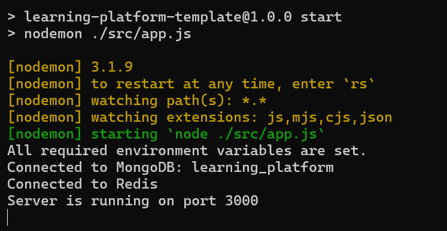
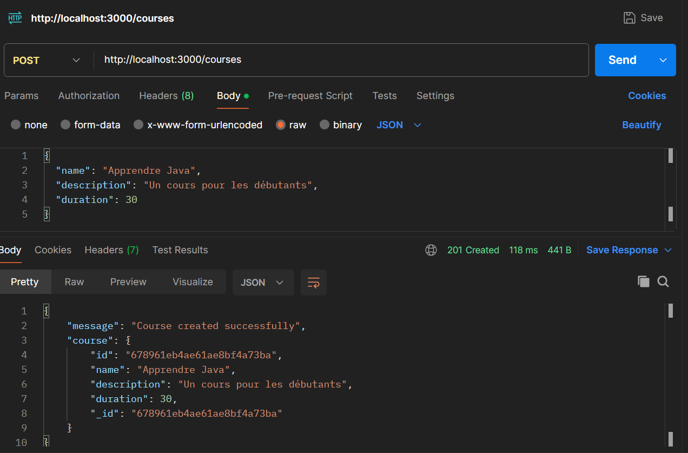
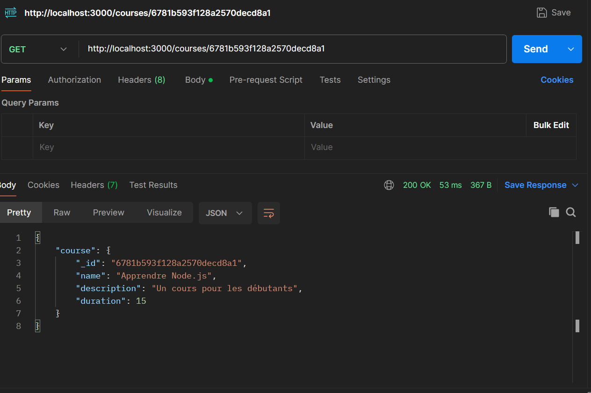
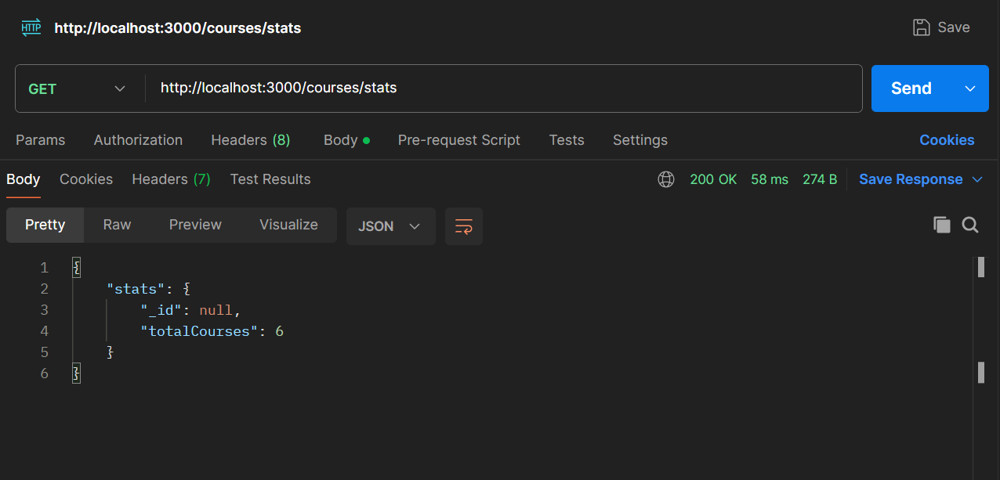

### Documentation du Projet Node.js avec MongoDB et Redis ###

## Installation et lancement du projet

### Prérequis
- Node.js (version 16 ou plus recommandée)
- MongoDB (base de données active)
- Redis (serveur actif)

### Étapes d'installation
1. Clonez le dépôt :
   ```
   git clone <URL_DU_DEPOT>
   ```
2. Accédez au répertoire du projet :
   cd <NOM_DU_PROJET>
   
3. Installez les dépendances :
      npm install
   
4. Configurez les variables d'environnement dans un fichier `.env` :
   ```env
   PORT=3000
   MONGODB_URI=<URL_DE_CONNEXION_MONGODB>
   REDIS_URI=<URL_DE_CONNEXION_REDIS>
   ```
5. Lancez le serveur :
   ```
   npm start
   ```

### Tester les routes avec Postman
- Utilisez Postman ou tout autre outil pour tester les points d'entrée de l'API.
- Les routes disponibles incluent :
  - POST `/courses` : Créer un nouveau cours.
  - GET `/courses/:id` : Récupérer un cours par ID.
  - GET `/courses/stats` : Récupérer les statistiques des cours.

### Structure du projet
├── config/        # Configuration de MongoDB, Redis et des variables d'environnement
├── controllers/   # Contient la logique métier pour chaque ressource
├── models/        # Modèles Mongoose pour MongoDB
├── routes/        # Définitions des routes pour l'API
├── services/      # Services pour les interactions avec MongoDB et Redis
├── app.js         # Point d'entrée de l'application
├── README.md      # Documentation
└── package.json   # Dépendances et scripts


## Choix techniques

1. **MongoDB :** Utilisé pour stocker les données des cours de manière flexible et scalable.
2. **Redis :** Utilisé pour le caching afin d'améliorer les performances de lecture et d'écriture fréquentes.
3. **Express :** Framework minimaliste pour la gestion des routes et des middlewares.
4. **Structure modulaire :** Séparation des préoccupations entre contrôleurs, services et routes pour une meilleure maintenabilité.

## Réponses aux questions posées

### app
### Question : Comment organiser le point d'entrée de l'application ?
**Réponse :** Créer un fichier principal (e.g., server.js, index.js ou app.js) qui configure l'application.
 * Décomposer les responsabilités :
*     Configurations : placer dans un fichier séparé (./config/env.js, ./config/db.js).
*     Routes : utiliser des fichiers spécifiques dans un dossier routes/.
*     Middlewares : regrouper dans un dossier middlewares/.
*     Initialisation de la base de données : dans un fichier spécifique, e.g., db.js.


### Question : Quelle est la meilleure façon de gérer le démarrage de l'application ?
**Réponse :** Utiliser une fonction asynchrone pour gérer l'initialisation :
    Démarrer les connexions à la base de données.
    Gérer les erreurs propres à chaque étape.
Gérer l'arrêt proprement :
  Écouter les signaux du système (e.g., SIGTERM, SIGINT).
  Fermer les connexions à la base de données avant de quitter.


### env
### Question: Quelles sont les informations sensibles à ne jamais commiter ?
**Réponse :** URI MongoDB, Nom de la Base de Données MongoDB , URI Redis,Port (PORT)  
### Question: Pourquoi utiliser des variables d'environnement ?
**Réponse :** Sécurisation des Informations Sensibles, Configuration Dynamique, Facilité de Maintenance  


### services
### Question : Pourquoi créer des services séparés ?
**Réponse :** Les services séparés améliorent l'organisation, la réutilisabilité et la maintenabilité du code, facilitent les tests et permettent une meilleure gestion des erreurs.

### Question : Comment gérer efficacement le cache avec Redis ?
**Réponse :** Utilisez des expirations (EXPIRE) pour limiter la durée de vie des clés, appliquez des stratégies LRU ou LFU pour l'éviction, et assurez une cohérence entre le cache et les données sources. Utilisez des préfixes pour les clés et sécurisez l'accès à Redis.

### Question : Quelles sont les bonnes pratiques pour les clés Redis ?
**Réponse :**  Utilisez des noms de clés lisibles et structurés, ajoutez des préfixes pour l'organisation, définissez des expirations appropriées, et privilégiez des structures de données adaptées à vos besoins. Limitez la longueur des clés pour une gestion optimale.

### controllers
### Question : Quelle est la différence entre un contrôleur et une route ?
**Réponse :** Une route définit l'URL et la méthode HTTP (GET, POST, etc.) d'une requête, tandis qu'un contrôleur contient la logique qui gère cette requête, comme l'accès aux données et la réponse.

### Question : Pourquoi séparer la logique métier des routes ?
**Réponse :** Séparer la logique métier des routes permet de rendre le code plus modulaire, lisible et réutilisable, facilitant ainsi la maintenance et les tests.

### Routes
### Question: Pourquoi séparer les routes dans différents fichiers ?
**Réponse :** pour améliorer la lisibilité, faciliter la maintenance, et éviter la surcharge d'un fichier unique en séparant les responsabilités par fonctionnalité ou module.

### Question : Comment organiser les routes de manière cohérente ?
**Réponse :** En regroupant les routes par domaine fonctionnel ou ressource (exemple : users, courses), en utilisant un fichier principal pour les monter et en respectant une structure hiérarchique claire.

### Copies d'écran
**Lancement du serveur**

**Test des routes avec Postman**





### Pour le rendu, voici ce que j'attends :
1. Un dépôt public sur Github avec un historique de commits clair
2. Un README.md qui explique :
   - Comment installer et lancer le projet
   - La structure du projet
   - Les choix techniques que vous avez faits
   - Les réponses aux questions posées dans les commentaires
3. Le code complété avec tous les TODOs implémentés

### Je vous conseille de procéder étape par étape :
1. Commencez par lire et comprendre la structure du projet
2. Répondez aux questions des commentaires dans le README
3. Implémentez progressivement les TODOs
4. Testez chaque fonctionnalité au fur et à mesure
5. Documentez vos choix et vos réflexions en ajoutant des copies d'écrans à votre fichier README.md

#### Bon courage
